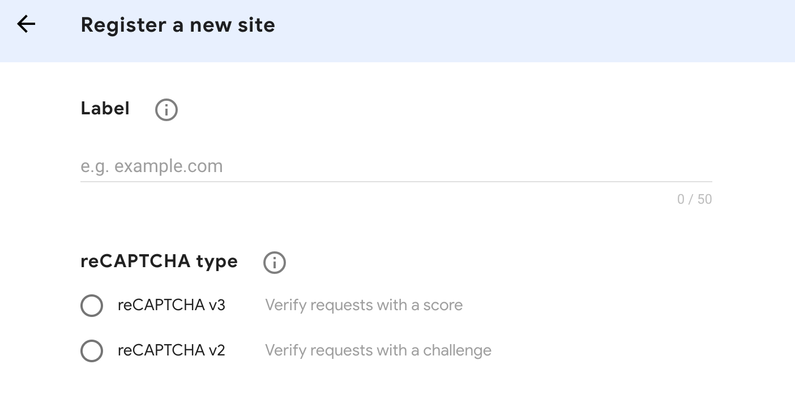

# Council

This is an open source forum that was built and maintained at Laracasts.com.

## Installation 

### Step 1.

> To run this project, you must have php 7 installed as prerequisite.

Begin by cloning this repository to your machine, and installing all Composer dependencies.

```bash
git clone https://github.com/erdenedavaa/council.git
cd council && composer install
php artisan key:generate
mv .env.example .env
```

### Step 2.

Next, create a new database and reference its name and username/password within the project's `.env` file. In the example below, we've named the database, "council".

```
DB_CONNECTION=mysql
DB_HOST=127.0.0.1
DB_PORT=3306
DB_DATABASE=council
DB_USERNAME=root
DB_PASSWORD=
```

### Step 3.

reCAPTCHA is a Google tool to help prevent from spam. You'll need to create a free account (don'w worry, it's quick).

> <a href="https://www.google.com/recaptcha/about/" target="_blank">https://www.google.com/recaptcha/about/</a>

Choose reCAPTCHA V3, and specify your local (and eventually production) domain name, as illustrated in the image below.



Once submitted, you'll see two important keys that should be referenced in your `.env` file.

```
RECAPTCHA_KEY=PAST_KEY_HERE
RECAPTCHA_SECRET=PASTE_SECRET_HERE
```

### Step 4.

Until an adminstrator portal is available, manually insert any number of "channels" (think of these as forum categories) into to "channels" table in your databse.

Once finished, clear your server cache, and you're all set to go!

```bash
php artisan cache:clear
```

## Step 5.

Use your forum! Visit http://council.test/threads to create a new account and publish your first thread.


